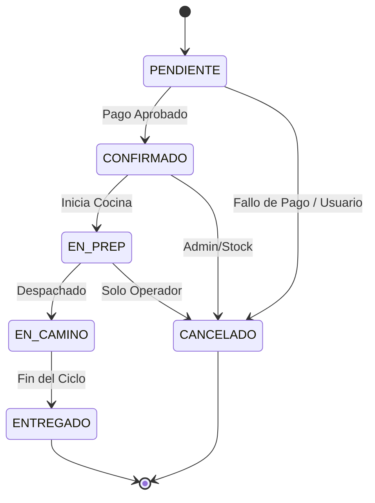

# 🍔 FOOD STORE | Especificación Técnica v4.0
> **Materia:** Programación 4 (TUP)  
> **Metodología:** Spec-Driven Development (SDD)  
> **Estado:** Versión Final 4.0 — *Incorpora Auditoría, UoW, MercadoPago y Zustand Completo*

---

## 1. 🎯 Visión General
**Food Store** es una solución robusta e integral para la gestión de negocios gastronómicos. El sistema no solo permite la venta online con pagos integrados, sino que garantiza la **trazabilidad absoluta** de cada pedido mediante un rastro de auditoría inmutable y una arquitectura de capas estrictamente definida.

### 1.1 Objetivos del Sistema
| # | Actor | Objetivo Principal |
| :--- | :--- | :--- |
| **OBJ-01** | 👤 Cliente | Navegación de catálogo, gestión de carrito, pago vía MercadoPago y rastreo con trazabilidad. |
| **OBJ-02** | 🔑 Admin | Gestión total de categorías, productos, stock y ciclo de vida de pedidos. |
| **OBJ-03** | 📦 Stock | Control granular de disponibilidad y existencias de productos. |
| **OBJ-04** | 🚚 Pedidos | Avance de estados según la máquina de estados definida. |
| **OBJ-05** | ⚙️ Sistema | Garantizar trazabilidad mediante *audit trail append-only*. |
| **OBJ-06** | 💳 Sistema | Procesamiento atómico de pagos mediante SDK de MercadoPago. |

---

## 2. 🛠️ Stack Tecnológico

### 🎨 Frontend
- **Framework:** React 18.x + TypeScript 5.x
- **Build Tool:** Vite 5.x
- **Estilos:** Tailwind CSS 3.x
- **Estado:** Zustand 4.x (Cliente) + TanStack Query 5.x (Servidor)
- **Formularios:** TanStack Form
- **Pagos:** @mercadopago/sdk-react

### ⚙️ Backend
- **Framework:** FastAPI 0.111+
- **ORM:** SQLModel (SQLAlchemy + Pydantic)
- **DB:** PostgreSQL 15+
- **Migraciones:** Alembic
- **Seguridad:** JWT (python-jose) + bcrypt (Passlib)
- **Resiliencia:** slowapi (Rate Limiting)

---

## 🏗️ 3. Arquitectura del Sistema

### 3.1 Capas del Backend
El sistema aplica una arquitectura de módulos por feature con **Unit of Work (UoW)** para garantizar atomicidad transaccional.

| Capa | Responsabilidad | Dependencias (¿A quién conoce?) |
| :--- | :--- | :--- |
| **Router** | Entrada HTTP, validación de schemas Pydantic. | Service |
| **Service** | **Lógica de Negocio**. Stateless. Orquesta mediante UoW. | UoW |
| **UoW** | Gestión de transacción (Commit/Rollback). | Repository, Session |
| **Repository** | Queries puras a la base de datos. | Model, Session |
| **Model** | Definición de tablas SQLModel y relaciones. | Ninguna |

> [!IMPORTANT]
> **REGLA DE ORO — FLUJO DE IMPORTS**  
> `Router` ➡️ `Service` ➡️ `UoW` ➡️ `Repository` ➡️ `Model`  
> Prohibido importar hacia arriba. Un `Model` jamás conoce un `Service`. Un `Repository` jamás conoce un `Router`.

### 3.2 Capas del Frontend
| Capa | Directorio | Responsabilidad |
| :--- | :--- | :--- |
| **Page** | `pages/` | Definición de rutas. Delegación pura a features. |
| **Feature** | `features/` | Componentes de dominio (formularios, tablas, lógica compleja). |
| **Component** | `components/` | Primitivos reutilizables y atómicos (UI pura). |
| **Hook** | `hooks/` | Encapsulación de lógica de TanStack Query. |
| **Store** | `store/` | Zustand: Estado global del cliente (Carrito, Sesión). |
| **API** | `api/` | Cliente Axios puro. Sin estado. |

---

## 📊 4. Modelo de Datos (Esquema 3FN)

### 4.1 Identidad y Acceso
- **Usuario:** BIGSERIAL (PK), Email (UQ), PasswordHash. Soft-delete.
- **Rol:** Catálogo (ADMIN, STOCK, PEDIDOS, CLIENT).
- **RefreshToken:** Manejo de sesiones seguras e invalidación en BD.
- **DireccionEntrega:** Soporte multi-dirección con marca de `es_principal`.

### 4.2 Catálogo y Productos
- **Categoria:** Estructura jerárquica recursiva (Self-ref).
- **Producto:** Manejo de stock, disponibilidad toggleable y precio base.
- **Ingrediente:** Identificación de **alérgenos** y soporte para ingredientes removibles.
- **FormaPago:** Catálogo de medios habilitados (MERCADOPAGO, EFECTIVO, etc).

### 4.3 Ventas y Pagos
- **Pedido:** Inmutable tras creación. Snapshot de total, costo de envío y dirección.
- **DetallePedido:** Snapshot de nombre y precio del producto al momento de la compra.
- **Pago:** Integración con MercadoPago (ID, Status, Idempotency Key).

---

## 🔄 5. Máquina de Estados de Pedidos

El flujo de los pedidos es estrictamente controlado por la lógica de negocio, impidiendo saltos de estado inválidos.



| Código | Descripción | Orden | Terminal | Transiciones Válidas |
| :--- | :--- | :--- | :---: | :--- |
| **PENDIENTE** | Esperando pago | 1 | ❌ | → CONFIRMADO, → CANCELADO |
| **CONFIRMADO** | Pago procesado | 2 | ❌ | → EN_PREP, → CANCELADO |
| **EN_PREP** | En cocina | 3 | ❌ | → EN_CAMINO, → CANCELADO |
| **EN_CAMINO** | En viaje | 4 | ❌ | → ENTREGADO |
| **ENTREGADO** | Finalizado | 5 | ✅ | — |
| **CANCELADO** | Anulado | 6 | ✅ | — |

---

## 📂 6. Estructura de Proyecto Sugerida

### 🔙 Backend
```text
app/
├── core/               # Infraestructura (UoW, BaseRepo, Security)
├── db/                 # Sesión y Seed Data
├── modules/            # Dominios de Negocio
│   ├── auth/
│   ├── productos/
│   ├── pedidos/
│   └── pagos/          # MercadoPago Integration
└── main.py             # Entrypoint
```

### 🎨 Frontend
```text
src/
├── api/                # Clientes Axios
├── store/              # Zustand Stores
├── hooks/              # TanStack Query Hooks
├── features/           # Componentes de Dominio
└── pages/              # Vistas de Ruta
```
